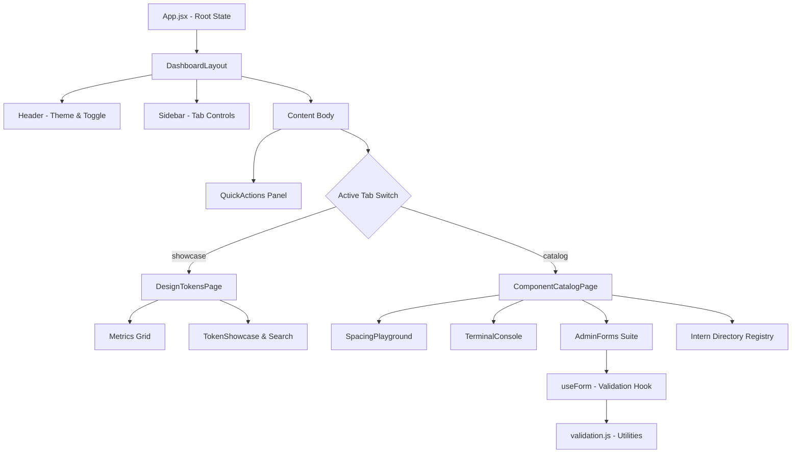

# Project Summary — UpToSkill Admin Dashboard

This document provides a technical breakdown of the architecture, components, features, and engineering decisions implemented in the **UpToSkill Admin Dashboard**.

---

## 1. Project Overview

The **UpToSkill Admin Dashboard** is a highly responsive, single-page administrative interface built using **React (v19)** and **Vite (v8)**. The application serves as a showcase of custom-token styling architectures, interactive visual playgrounds, dynamic directories, and digital accessibility (A11y). 

It is designed to give administrators a unified interface to manage users, configure design systems, track action events in real-time, and schedule course cohorts safely under high-contrast lighting shifts.

---

## 2. System Architecture

The application adopts a clean, modular structure emphasizing strict unidirectional data flow and clear separation of concerns:

-   **State Management Layer (`App.jsx`)**: Coordinates core shell statuses including user preferences (theme toggle and storage syncing), tab switches, quick-actions dialog toggles, and global toast arrays.
-   **Routing & Layout Layer (`DashboardLayout.jsx`)**: Resolves layout grid boundaries, mapping mobile collapsible menu drawers and sidebar templates cleanly.
-   **Views Layer (`/pages`)**: Separates complex dashboards. `DesignTokensPage` acts as the system tokens visualizer, while `ComponentCatalogPage` maps active workspace components, registration grids, and directories.
-   **Validation Hook (`useForm.js`)**: Encapsulates form-handling states (values, focus-touches, asynchronous mock submissions, success state feedback).
-   **CSS Pipeline (`index.css`)**: Linear imports connecting Design Tokens (`tokens.css`) to atomic components (`components.css`) and responsive layouts (`dashboard.css`).

---

## 3. Key Reusable Components

The dashboard contains highly atomic, self-contained components:

1.  **`MetricCard`**: Displays numeric stats, contextual icons, and color-coded positive/negative trend values using HSL transparencies.
2.  **`Modal`**: An accessible dialog layout container that encapsulates keyboard ref focus traps and global event listeners.
3.  **`FormInput`**: Multi-functional element supporting normal texts, selectors, textareas, eye togglers, and integrated real-time password strength visualizer tracks.
4.  **`EmptyState` & `ErrorState`**: Seamless visual fallbacks. `ErrorState` is equipped with active retry dispatch methods, and `EmptyState` includes redirection buttons.
5.  **`SkeletonCard` & `SkeletonTable`**: Pure CSS shimmer skeleton boxes mapping columns and avatars to match structural components perfectly during async latency loads.
6.  **`SpacingPlayground`**: A real-time sandbox enabling developers to dynamically adjust `--space-*` and `--radius-*` tokens using visual selectors.
7.  **`TerminalConsole`**: Interactive event log terminal capturing transition durations and action dispatches.

---

## 4. Accessibility Features (A11y)

Built with compliance to digital accessibility guidelines:

-   **Keyboard Focus Traps**: Utilizing `useRef` and `useEffect` in the `Modal` component to trap active browser focus cycle tabs exclusively within open dialog boundaries, preventing background element interactions.
-   **Global Escape Binders**: Keyboard listener actively listening to the `Escape` key to safely dismiss overlays, alerts, and modals instantly.
-   **Landmarks & Semantics**: Elements are fully annotated with modern ARIA tags (`role="dialog"`, `role="alert"`, `role="progressbar"`, `aria-modal="true"`, `aria-busy`, `aria-invalid`, `aria-describedby`).
-   **Visual Ergonomics**: Clear, high-contrast labels connected to input nodes via explicit `htmlFor` variables, enabling clean screen-reader associations.

---

## 5. Responsive Design Strategy

The application layout shifts smoothly across device sizes using mobile-first media query breakpoints:

| Breakpoint | Target Device | Layout Behavior |
| :--- | :--- | :--- |
| **$\ge$ 1024px** | Desktop / Laptops | 5-column metric grids, visible sidebar navigation, parallel side-by-side component catalogs. |
| **640px to 1023px**| Tablet / Screens | Collapsible menu drawer, 2-column metrics cards grids, stacked vertical catalogs. |
| **$\le$ 639px** | Mobile Devices | Full-width single-column blocks, overlapping backdrop drawers, screen-width toasts and dialog modules. |

---

## 6. Technical Highlights & Outcome

-   **Zero Layout Shift Theme Engine**: The dashboard checks system color-scheme preferences (`matchMedia`) on initial load, caches choices to browser `localStorage`, and binds themes via the `.dark-theme` body class.
-   **Warning-Free Compilation**: The codebase has successfully completed a strict audit review. By eliminating unused dependencies (`useEffect` in catalog page, `React` imports in modern JSX contexts) and resolving `no-useless-assignment` cases, the linter reports zero warnings and zero errors.
-   **Blazing Fast Builds**: Vite transforms, builds, and minifies the production output in less than **250ms**, producing clean, tree-shaken static assets under `dist/` ready for global CDN publication.
-   **Robust Form Validation**: Simulated double-entry checks block duplicate email or course registries inside session memory databases, ensuring high-fidelity database mock integrity.

---

## 7. Author & Showcase Credentials

-   **Author**: Sushant Singh
-   **Repository**: [uptoskill-admin-dashboard](https://github.com/sushantsingh/uptoskill-admin-dashboard.git)
-   **Preview**: [https://uptoskill-admin-dashboard.vercel.app](https://uptoskill-admin-dashboard.vercel.app)
